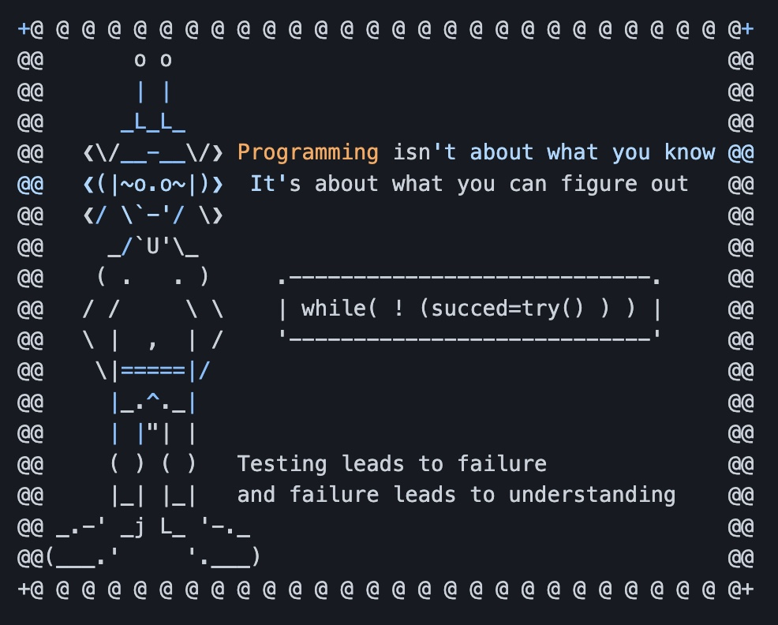

# <p align="center">[)](https://git.io/typing-svg)</p>
      
      
  
  <h2>   About Me   
  </h2>
  
  ```js
  const Michael = {
    code: ["Javascript", "C#"],
    askMeAbout: ["christian", "husband", "dad", "web dev"],
    currentRole: "Freelancer",
    technologies: {
        frontEnd: "React",
        backEnd: {
            js: ["Node", "Express"],
        },
        mobileApps: {
            hybrid: ["React Native, Xamarin"],
            native: []
        },
        desktopApps: {
            windows: "Forms",
            multi: "Electron"
        },
        devOps: ["AWS", "Heroku"],
        databases: ["mongo", "Postgres", "sqlite"],
    },
    architecture: ["Single page applications"],
};
  ```
<h2>Connect with me
</h2>

```bash
npx nunez
```

  <h2>   Contributions   </h2>
  
  
  
  
  <h2>   Stats </h2>
  
<!--START_SECTION:waka-->


**🐱 My GitHub Data** 

> 📦 327.2 kB Used in GitHub's Storage 
 > 
> 🏆 117 Contributions in the Year 2023
 > 
> 💼 Opted to Hire
 > 
> 📜 6 Public Repositories 
 > 
> 🔑 12 Private Repositories 
 > 
**I'm an Early 🐤** 

```text
🌞 Morning                48 commits          █████░░░░░░░░░░░░░░░░░░░░   19.83 % 
🌆 Daytime                123 commits         █████████████░░░░░░░░░░░░   50.83 % 
🌃 Evening                50 commits          █████░░░░░░░░░░░░░░░░░░░░   20.66 % 
🌙 Night                  21 commits          ██░░░░░░░░░░░░░░░░░░░░░░░   08.68 % 
```
📅 **I'm Most Productive on Friday** 

```text
Monday                   29 commits          ███░░░░░░░░░░░░░░░░░░░░░░   11.98 % 
Tuesday                  32 commits          ███░░░░░░░░░░░░░░░░░░░░░░   13.22 % 
Wednesday                39 commits          ████░░░░░░░░░░░░░░░░░░░░░   16.12 % 
Thursday                 27 commits          ███░░░░░░░░░░░░░░░░░░░░░░   11.16 % 
Friday                   58 commits          ██████░░░░░░░░░░░░░░░░░░░   23.97 % 
Saturday                 29 commits          ███░░░░░░░░░░░░░░░░░░░░░░   11.98 % 
Sunday                   28 commits          ███░░░░░░░░░░░░░░░░░░░░░░   11.57 % 
```


📊 **This Week I Spent My Time On** 

```text
🕑︎ Time Zone: America/Chicago

💬 Programming Languages: 
JavaScript               2 mins              █████████████████████░░░░   84.73 % 
CSS                      0 secs              ████░░░░░░░░░░░░░░░░░░░░░   15.27 % 

🔥 Editors: 
VS Code                  2 mins              █████████████████████████   100.00 % 

💻 Operating System: 
Mac                      2 mins              █████████████████████████   100.00 % 
```

**I Mostly Code in JavaScript** 

```text
JavaScript               6 repos             ████████░░░░░░░░░░░░░░░░░   33.33 % 
C#                       3 repos             ████░░░░░░░░░░░░░░░░░░░░░   16.67 % 
CSS                      2 repos             ███░░░░░░░░░░░░░░░░░░░░░░   11.11 % 
Liquid                   1 repo              █░░░░░░░░░░░░░░░░░░░░░░░░   05.56 % 
HTML                     1 repo              █░░░░░░░░░░░░░░░░░░░░░░░░   05.56 % 
```


 Last Updated on 20/04/2023 00:19:27 UTC
<!--END_SECTION:waka-->
  
  <p align="center">  </p>
  
  <!--
  <p align="center"> </p>
  
 
 | | |
| ------- | --- |
|  | <br>[](https://spotify-github-profile.vercel.app/api/view?uid=3144iv3jsdbf2s4xsszxlpggc5g4&redirect=true) | -->


  
<!-- => Pixel art of me to the right section

# Contact info and view contacer, waka readme?, buy me coffee

# Clickable image => Calendly

# stats and icons -->
